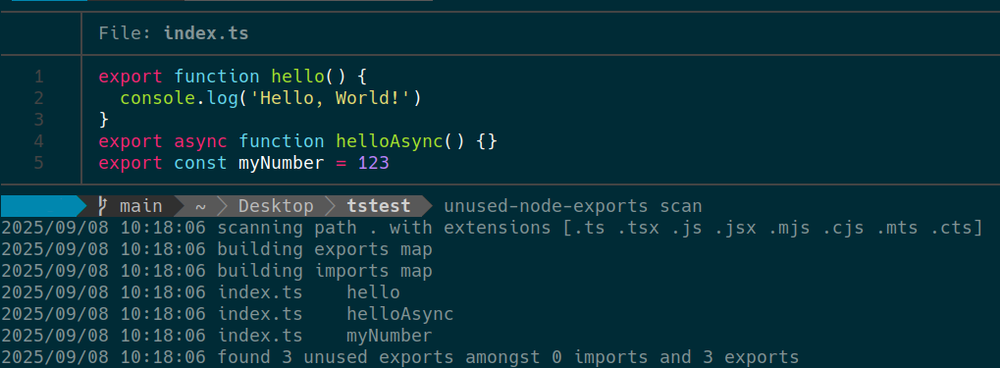

# unused-node-exports

A fast CLI tool to find unused exports in Node.js and TypeScript projects. It scans your git repository for exported functions, that are not imported anywhere else in your codebase.

## Installation

### Using go:

```
go install github.com/aherve/unused-node-exports/v2@latest
```

### Downloading the binary:

Precompiled binaries are available on the [releases page](https://github.com/aherve/unused-node-exports/releases)

## Usage

Scan your current git repository for unused exports:

```
unused-node-exports scan
```

Options:

- `--help, -h`: Show help message.
- `--path, -p`: Path to the git repository to scan (default: current directory).
- `--file-extensions, -e`: Comma-separated list of file extensions to scan (default: .ts, .tsx, .js, .jsx, .mjs, .cjs, .mts, .cts).
- `--output, -o`: Output results to a CSV file.

Example:

```
unused-node-exports scan -p ./my-project -e .ts,.tsx -o unused.csv
```

## Example Output



## How it works

1. Using `git grep`, find all files that contain `export [async] [function|const]` statements and extract the exported names.
2. Using `git grep`, find all files that contain `import` statements, and extract the imported names.
3. Compare the two sets and identify exported names that are not imported anywhere else in the code

This process is extremely fast and works on large codebases that export sub-modules such as turbo-repo or monorepo. However, it may not catch all edge cases. Performances are prioritized over perfection.

## Why not using existing npm packages?

I created this tool to work on a large codebase where the existing npm tools I tried quickly run out of memory.
